# CodEval Execution Engine — All Mermaid Diagrams

**Source:** Technical Architecture & Performance Report  
**Date:** May 25, 2026  
**System:** CodEval Platform — Module 2: Execution Engine

---

## Diagram 1 — High-Level System Architecture

> Shows the full system topology: client, engine host, supporting infrastructure (Kafka, Redis, PostgreSQL), and sandbox pool with all communication flows.

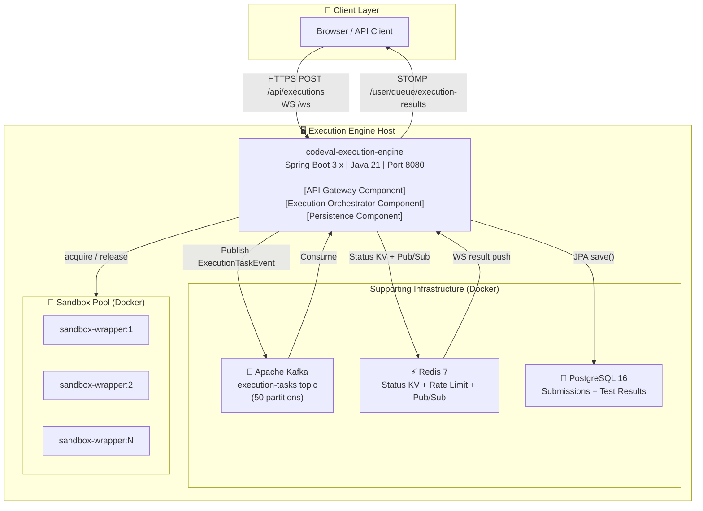

---

## Diagram 2 — Internal Component Architecture

> Breaks down the monolith into its four internal components (API Gateway, Orchestrator, Persistence, Sandbox Wrapper) with internal data flows.

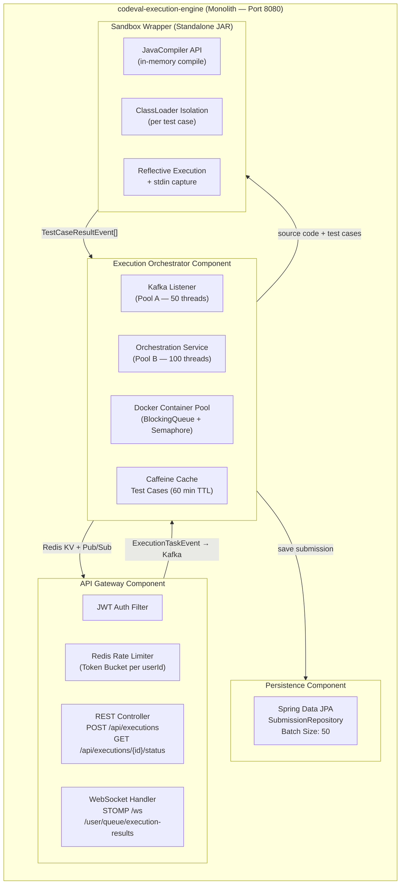

---

## Diagram 3 — End-to-End Request Sequence

> Full lifecycle of a single code submission from HTTP POST through Kafka, sandbox execution, DB persistence, and WebSocket result delivery.

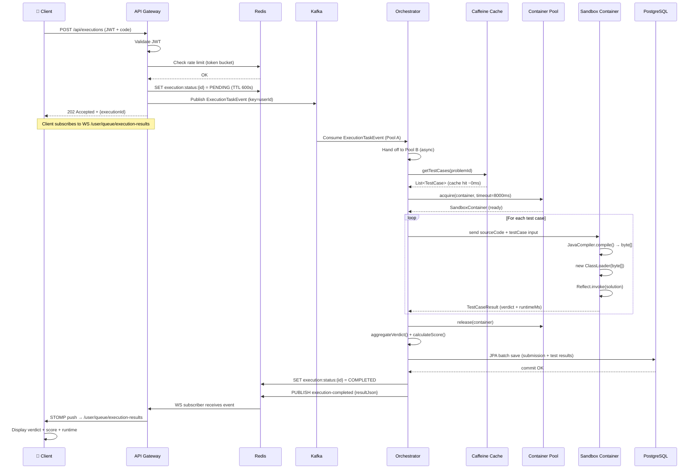

---

## Diagram 4 — Sandbox Execution Pipeline (Flowchart)

> Step-by-step flow inside the sandbox container: in-memory compilation, per-test-case ClassLoader isolation, reflective execution, and container reuse.

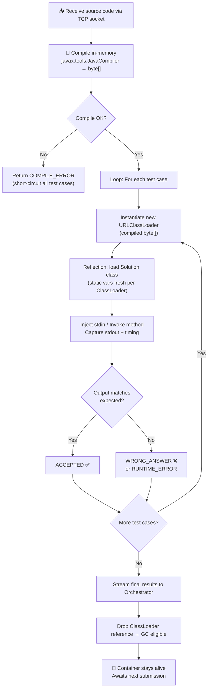

---

## Diagram 5 — Thread Pool & Concurrency Model

> Shows the two-pool architecture: Kafka Listener Pool (Pool A) decoupled from Orchestration Pool (Pool B), both gated by the Semaphore-capped container pool.

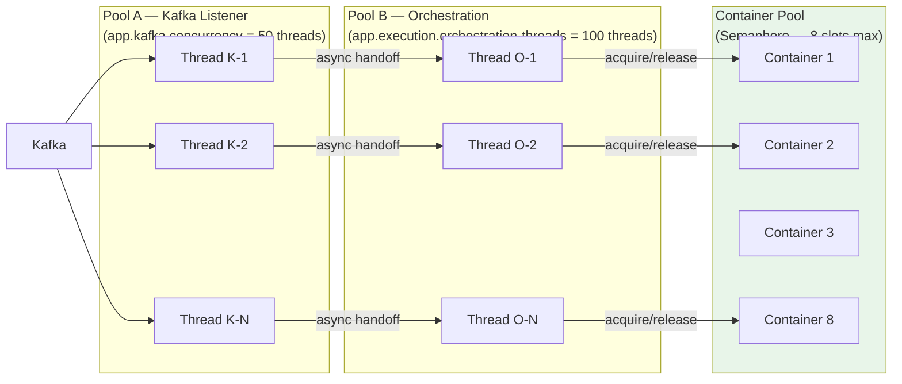

---

## Diagram 6 — Error Handling & Resilience Flows

> Maps every failure scenario (compile error, runtime error, TLE, DB failure, container crash) to its detection point and recovery behaviour.

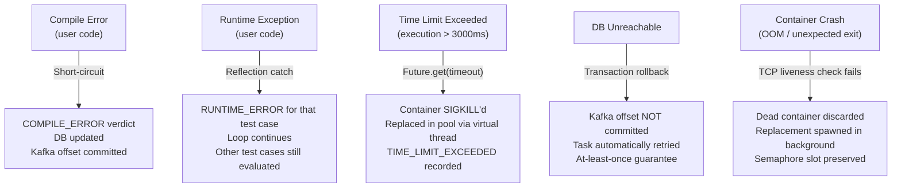

---

## Diagram 7 — Observability Pipeline (Prometheus → Grafana)

> Shows how the engine exposes metrics via Spring Boot Actuator, scraped by Prometheus every 15s, and visualised in the Grafana dashboard.

```mermaid
graph LR
    Engine["Execution Engine\n(Spring Boot Actuator)"] -->|"/actuator/prometheus\n(scrape every 15s)"| Prom["Prometheus\n(Time-series DB)"]
    Prom -->|"PromQL queries"| Grafana["Grafana Dashboard"]
    Grafana --> Panels

    subgraph Panels["Dashboard Panels"]
        P1["📊 Total Submissions"]
        P2["📈 Submission Rate (req/s)"]
        P3["⏱️ Avg Submission Time (ms)"]
        P4["🔴 Rate-Limited (429) Count"]
        P5["📨 Kafka Processing Time"]
        P6["🌐 WS Results Sent / Failures"]
        P7["🗑️ GC Pause Time (ms)"]
        P8["💾 JVM Heap Usage"]
    end
```

---

## Diagram 8 — Submit Response Latency: 30 RPS Run (Bar Chart)

> Latency distribution for the 30-RPS burst test: min 8ms, avg 97ms, max 2,813ms across 4,800 requests.

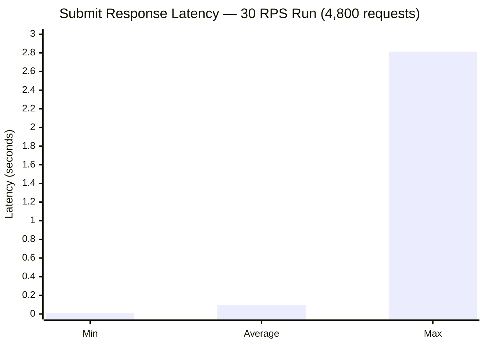

---

## Diagram 9 — Submit Response Latency: 50 RPS Run (Bar Chart)

> Latency distribution for the 50-RPS burst test: min 7ms, avg 92ms, max 1,701ms across 9,950 requests. Max latency improved 40% vs the 30 RPS run.

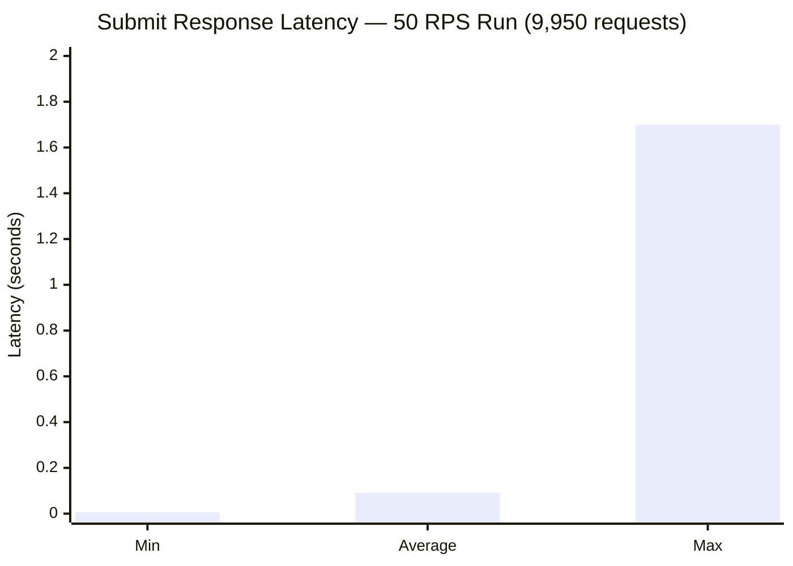

---

## Diagram 10 — Execution Verdicts: 30 RPS Run (Pie Chart)

> 100% of 4,800 executions completed. Zero timeouts, zero unresolved.

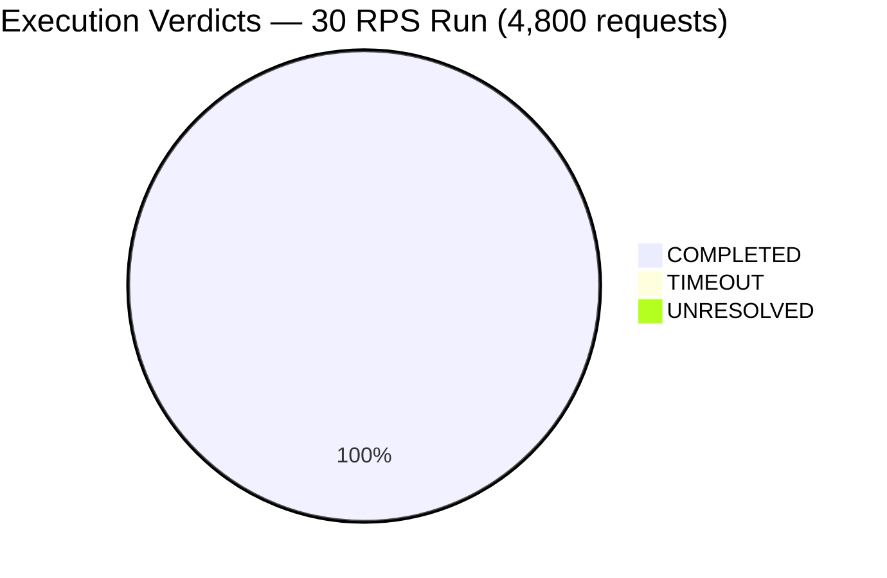

---

## Diagram 11 — Throughput Comparison: 30 RPS vs 50 RPS (Bar Chart)

> Achieved throughput grew +64% (22.5 → 37.0 req/s) with identical hardware, demonstrating clean linear scaling.

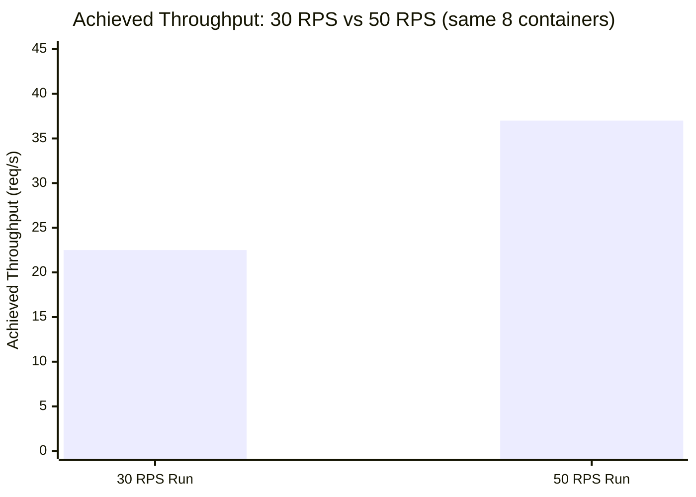

---

## Diagram 12 — Theoretical vs Achieved Throughput (Bar Chart)

> Achieved throughput (37 req/s) exceeds the theoretical sustained maximum (20 req/s) because Kafka queue buffering absorbs burst waves.

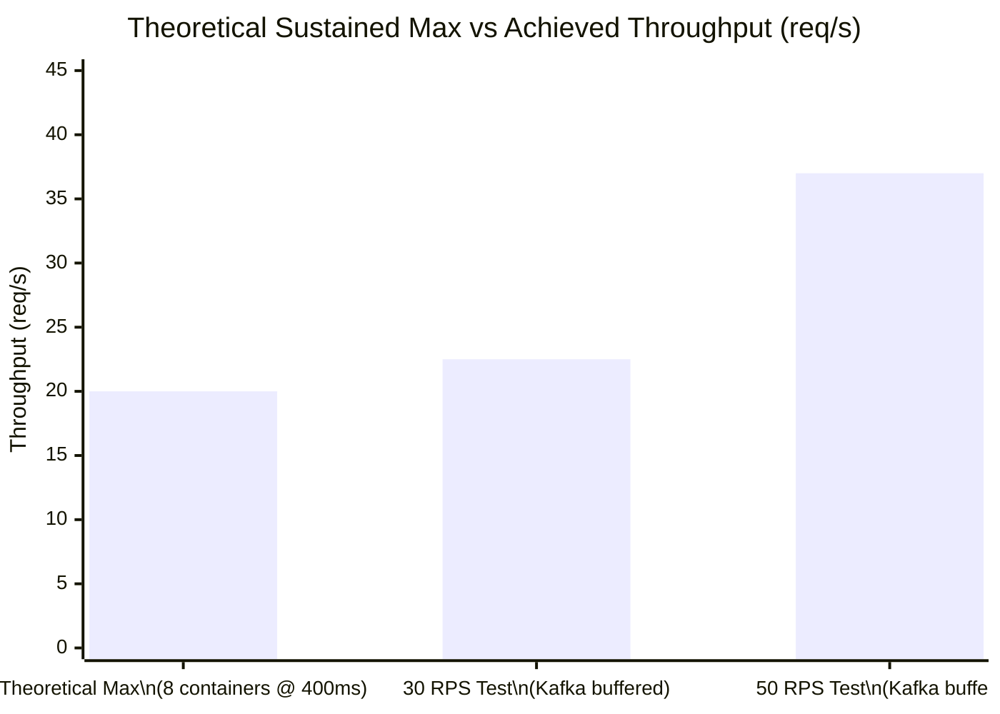

---

## Diagram 13 — Full System Pipeline (Condensed)

> All system layers shown accurately with key components — condensed to one or two nodes per zone.

```mermaid
flowchart LR
    USER(["👤 User\nBrowser"])

    subgraph GW["🔐 API Gateway"]
        direction TB
        AUTH{{"JWT Auth · Rate Limit"}}
        PUB(["Write PENDING → Redis\nPublish to Kafka · HTTP 202"])
    end

    subgraph KAFKA["📨 Apache Kafka — execution-tasks · 50 partitions · acks=all · key=userId"]
        direction LR
        PROD(["Producer"])
        TOPIC[("Broker\n0…49")]
        CONS(["Pool A\n50 threads"])
    end

    subgraph ORCH["⚙️ Execution Orchestrator"]
        direction TB
        PB(["Pool B · 100 threads\nCaffeine Cache → Test Cases"])
        SEM{{"Semaphore · 8 slots\nacquire / release"}}
    end

    subgraph SB["🐳 Sandbox Pool — 8 pre-warmed containers"]
        direction TB
        EXEC(["Compile once · JavaCompiler\nnew ClassLoader per test case\nReflect.invoke → verdict"])
    end

    subgraph DELIVER["📡 Persist & Deliver"]
        direction TB
        DB[("🐘 PostgreSQL\nJPA batch save")]
        REDIS[("⚡ Redis KV + Pub/Sub\nstatus=COMPLETED · notify")]
        WS(["🔔 WebSocket\nSTOMP push to user"])
    end

    USER -->|"POST /api/executions"| AUTH
    AUTH --> PUB
    PUB -.->|"202 instantly"| USER
    PUB --> PROD --> TOPIC --> CONS
    CONS --> PB --> SEM
    SEM -->|"acquire"| EXEC
    EXEC -->|"release"| SEM
    EXEC --> DB
    EXEC --> REDIS
    REDIS --> WS
    WS -->|"real-time result"| USER

    style GW      fill:#4a148c,color:#fff,stroke:#6a1b9a
    style KAFKA   fill:#bf360c,color:#fff,stroke:#7f0000
    style ORCH    fill:#0d47a1,color:#fff,stroke:#002984
    style SB      fill:#b71c1c,color:#fff,stroke:#7f0000
    style DELIVER fill:#1b5e20,color:#fff,stroke:#003300
    style USER    fill:#263238,color:#fff,stroke:#37474f
    style AUTH    fill:#6a1b9a,color:#fff,stroke:#4a148c
    style PUB     fill:#6a1b9a,color:#fff,stroke:#4a148c
    style PROD    fill:#e64a19,color:#fff,stroke:#bf360c
    style TOPIC   fill:#e64a19,color:#fff,stroke:#bf360c
    style CONS    fill:#e64a19,color:#fff,stroke:#bf360c
    style PB      fill:#1565c0,color:#fff,stroke:#0d47a1
    style SEM     fill:#880e4f,color:#fff,stroke:#560027
    style EXEC    fill:#7f0000,color:#fff,stroke:#4a0000
    style DB      fill:#2e7d32,color:#fff,stroke:#1b5e20
    style REDIS   fill:#00695c,color:#fff,stroke:#004d40
    style WS      fill:#006064,color:#fff,stroke:#004d40
```

---

## Diagram 14 — Condensed System Pipeline (Visual)

> Clean horizontal pipeline: one node per major stage, colour-coded by layer.

```mermaid
flowchart LR
    USER(["👤 User"])
    GW{{"🔐 API Gateway\nJWT · Rate Limit · 202"}}
    KAFKA[("📨 Kafka\nexecution-tasks")]
    ORCH(["⚙️ Orchestrator\nPool A → Pool B\nCaffeine Cache"])
    SB(["🐳 Sandbox Pool\n8 containers\ncompile · execute"])
    REDIS[("⚡ Redis\nKV · Pub/Sub")]
    WS(["🔔 WebSocket\nSTOMP result"])

    USER -->|"POST /api/executions"| GW
    GW -->|"publish event"| KAFKA
    KAFKA -->|"consume"| ORCH
    ORCH -->|"acquire / release"| SB
    SB -->|"verdict + score"| REDIS
    REDIS -->|"pub/sub notify"| WS
    WS -->|"real-time result"| USER
    GW -.->|"202 Accepted instantly"| USER

    style USER fill:#37474f,color:#fff,stroke:#263238
    style GW fill:#7b1fa2,color:#fff,stroke:#4a148c
    style KAFKA fill:#f57f17,color:#fff,stroke:#e65100
    style ORCH fill:#6a1b9a,color:#fff,stroke:#4a148c
    style SB fill:#c62828,color:#fff,stroke:#b71c1c
    style REDIS fill:#00695c,color:#fff,stroke:#004d40
    style WS fill:#1565c0,color:#fff,stroke:#0d47a1
```

---

*All diagrams extracted from TECHNICAL_ARCHITECTURE_DOCUMENT.md — CodEval Platform, May 25, 2026*

