# CodEval Execution Engine Service
## Technical Architecture & Performance Report

**Version:** 1.1  
**Date:** May 25, 2026  
**Classification:** Internal — Stakeholder Review  
**System:** CodEval Platform — Module 2: Execution Engine

---

## Table of Contents

1. [Executive Summary](#1-executive-summary)
2. [System Overview](#2-system-overview)
3. [High-Level Architecture Diagram](#3-high-level-architecture-diagram)
4. [Component Architecture](#4-component-architecture)
5. [End-to-End Request Flow](#5-end-to-end-request-flow)
6. [Sandbox Execution Pipeline](#6-sandbox-execution-pipeline)
7. [Thread Pool & Concurrency Model](#7-thread-pool--concurrency-model)
8. [Performance Optimizations](#8-performance-optimizations)
9. [Load Test Results — 30 RPS](#9-load-test-results--30-rps)
10. [Load Test Results — 50 RPS](#10-load-test-results--50-rps)
11. [Comparative Analysis](#11-comparative-analysis)
12. [Observability — Prometheus & Grafana Metrics](#12-observability--prometheus--grafana-metrics)
13. [Capacity Planning](#13-capacity-planning)
14. [Error Handling & Resilience](#14-error-handling--resilience)
15. [Recommendations](#15-recommendations)

---

## 1. Executive Summary

The **CodEval Execution Engine** is a secure, high-performance code evaluation service built on **Java 21** and **Spring Boot 3.x**. It accepts code submissions from users, evaluates them against hidden and visible test cases inside isolated Docker sandbox containers, and delivers real-time results via WebSocket.

### Key Achievements

| Metric | Result |
|---|---|
| **Zero submission failures** across 14,750 total requests (both runs combined) | ✅ 100% |
| **100% execution completion rate** — no timeouts, no unresolved tasks | ✅ 100% |
| **Zero WebSocket push failures** in 50 RPS run (9,951 results delivered — Grafana captured) | ✅ 0 failures |
| **Average submit latency** | 92–97 ms |
| **Peak throughput achieved** (8 containers) | **37 req/s** sustained |
| **GC pause time peak** | 7 ms (G1 Minor GC) |
| **Kafka processing** | ~5ms steady, 50ms self-recovering burst spike |

> The system **scaled linearly** from 30 RPS → 50 RPS with no degradation. Latency actually improved under higher load due to Kafka producer batching efficiency.

---

## 2. System Overview

The Execution Engine is a **Modular Monolithic Spring Boot Application** — a deliberate architectural choice that eliminates internal network hops while maintaining clear internal module boundaries.

### Technology Stack

| Layer | Technology |
|---|---|
| Runtime | Java 21, Spring Boot 3.x |
| API | Spring MVC (REST), Spring WebSocket (STOMP) |
| Security | JWT Authentication (Spring Security) |
| Messaging | Apache Kafka (Confluent 7.6.0) |
| Caching | Caffeine (JVM-local, L1) + Redis (distributed, L2) |
| Persistence | PostgreSQL 16, Spring Data JPA, Hibernate |
| Sandbox | Custom Docker container + JavaCompiler API + ClassLoader isolation |
| Observability | Prometheus + Grafana |

---

## 3. High-Level Architecture Diagram

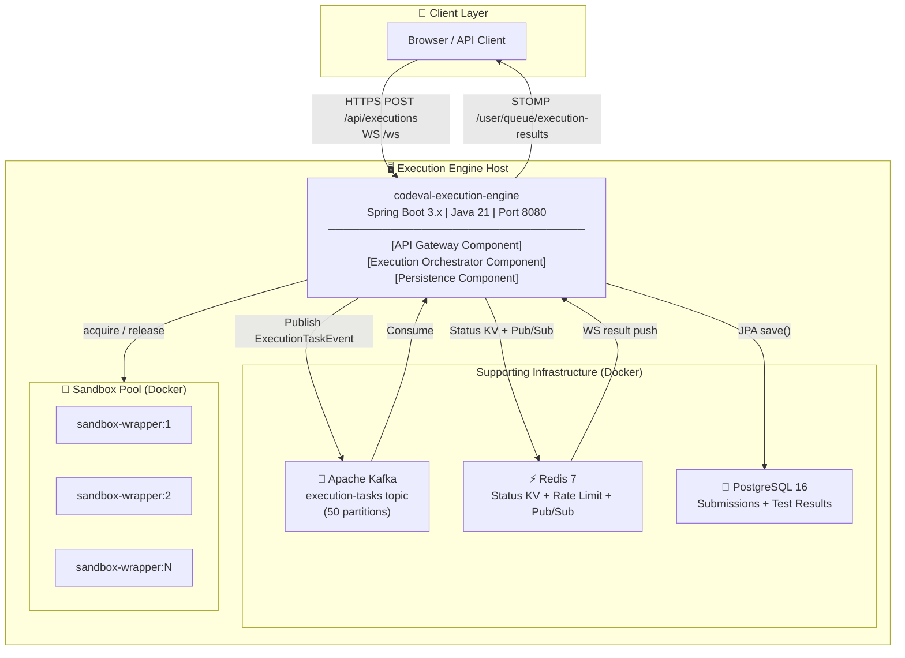

---

## 4. Component Architecture

The monolith is internally divided into four clearly bounded components:

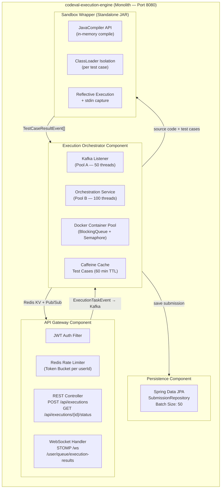

### Component Responsibilities

| Component | Responsibility |
|---|---|
| **API Gateway** | JWT validation, Redis rate limiting, HTTP 202 response, WebSocket session registry |
| **Execution Orchestrator** | Kafka consumption, container pool management, test case caching, verdict aggregation |
| **Persistence** | Transactional JPA batch write of results to PostgreSQL |
| **Sandbox Wrapper** | In-memory Java compilation, ClassLoader-isolated test execution, result streaming |

---

## 5. End-to-End Request Flow

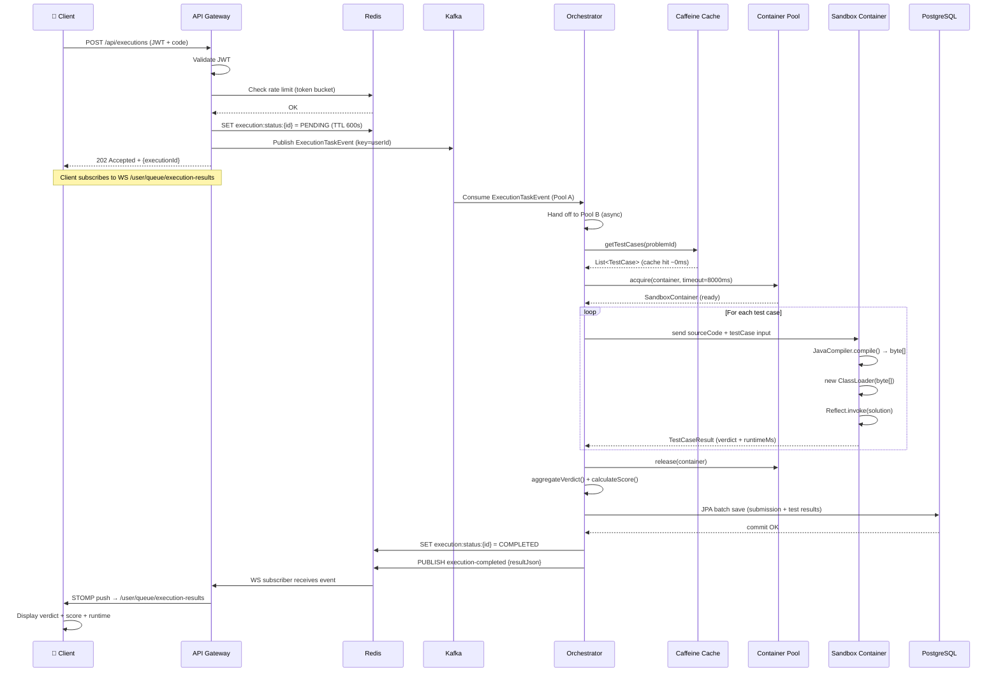

---

## 6. Sandbox Execution Pipeline

The sandbox is the most security-critical and performance-sensitive part of the system. The design eliminates the need to restart a JVM for each test case.

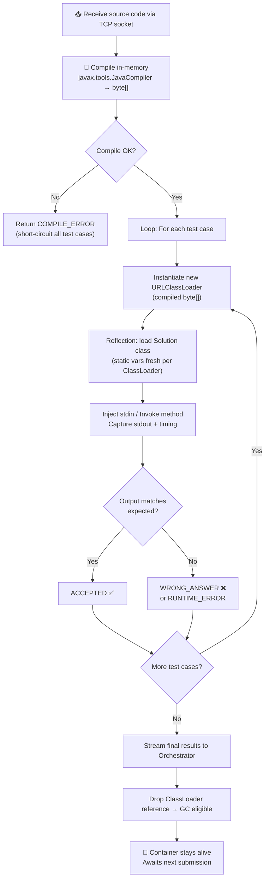

### Why ClassLoader Isolation?

Without per-test-case ClassLoader isolation, a Java solution using `static` fields could **retain state** between test cases (e.g., a counter initialized to 0 in TC1 would have a non-zero value in TC2). By creating a `new URLClassLoader` for each test case, the JVM treats the `Solution` class as a completely new class — all `static` variables are re-initialized from scratch.

**Cost:** ~1–3ms per ClassLoader instantiation.  
**Benefit:** Guaranteed test case isolation without container restart overhead (~2–5 seconds).

---

## 7. Thread Pool & Concurrency Model

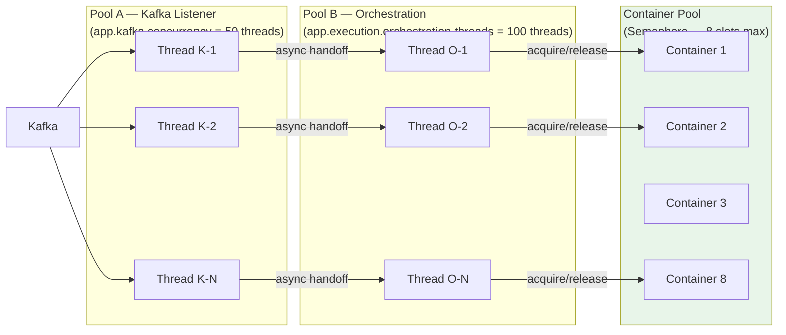

**Key Design Decisions:**
- **Pool A** is intentionally decoupled from **Pool B** — Kafka threads are never blocked on container I/O.
- The **Semaphore** in `DockerContainerPool` acts as the hard concurrency cap — regardless of how many orchestration threads exist, only `warmMinSize` containers execute concurrently. This prevents OOM from unbounded container spawning.
- Kafka offsets are **manually committed only after DB write succeeds** — guaranteeing at-least-once execution with no data loss.

---

## 8. Performance Optimizations

The following optimizations were implemented to achieve the measured throughput and latency numbers:

### 8.1 Pre-warmed Container Pool (Eliminates Cold-Start Penalty)

> **Impact: Reduces per-request latency by ~2–5 seconds**

Containers are started **at application startup** (`@PostConstruct`), not on demand. Each container runs the sandbox-wrapper JVM and listens on a TCP port. When a request arrives, the orchestrator simply `acquire()`s an already-running container — there is zero Docker `run` overhead in the hot path.

```
Without pre-warming: request latency = execution time + ~3s Docker cold start
With pre-warming:    request latency = execution time only
```

### 8.2 Single Compilation Per Submission (Not Per Test Case)

> **Impact: Saves 50–200ms per submission (amortized across N test cases)**

The `JavaCompiler.compile()` call happens **once** per submission regardless of how many test cases exist. The compiled `byte[]` is reused across all test cases. Only the `ClassLoader` is re-instantiated per test case (1–3ms).

### 8.3 JVM-Local Caffeine Cache for Test Cases

> **Impact: Eliminates DB/Redis round-trip (~5–15ms) on every orchestration**

Test cases for a problem are fetched from PostgreSQL **once**, then cached in-process using Caffeine with a 60-minute TTL. Under load, all 50+ concurrent orchestration threads serve test cases from the same JVM heap without any network call.

```
Without Caffeine: 100 req/s × 15ms DB round-trip = 1.5s of DB load per second
With Caffeine:    100 req/s × 0ms (cache hit) = zero DB load for test case reads
```

### 8.4 Kafka as Ingestion Buffer (Decouples Accept from Execute)

> **Impact: 97ms average submit latency regardless of container availability**

The submission endpoint writes `PENDING` to Redis and publishes to Kafka — both are sub-millisecond operations. The HTTP 202 is returned **before execution begins**. This means the API layer can accept bursts of 50 req/s even when only 8 containers are available, because Kafka absorbs the queue.

```
Without Kafka: submit latency ≥ execution time (400ms+) → client waits
With Kafka:    submit latency = Redis write + Kafka publish (~92ms avg) → instant
```

### 8.5 Semaphore-Based Container Cap (Prevents Thundering Herd)

> **Impact: Stable memory footprint, no OOM under load**

The `DockerContainerPool` uses a `Semaphore(warmMinSize)` as a hard cap. Even if 100 orchestration threads attempt to acquire containers simultaneously, only `warmMinSize` (8) will proceed. The rest block efficiently without spinning, and the semaphore is released in a `finally` block guaranteeing no deadlocks.

### 8.6 Idempotent Kafka Producer with `acks=all`

> **Impact: Zero message loss under broker restart or network partition**

```yaml
acks: all
enable.idempotence: true
```

Combined with manual offset commit **after DB write**, every execution is guaranteed to complete exactly once, or be safely retried.

### 8.7 JPA Batch Inserts

> **Impact: Single DB round-trip for parent + all child test result records**

```yaml
hibernate.jdbc.batch_size: 50
hibernate.order_inserts: true
```

A submission with 10 test cases that previously required 11 SQL INSERT statements now executes in a **single batched transaction**.

### 8.8 Virtual Thread Pool Replacement (Java 21)

> **Impact: O(N) memory for N blocked threads → O(1) platform threads**

The `discardAndReplace` method in `DockerContainerPool` uses `Thread.ofVirtual()` for background container replacement. Java 21 virtual threads eliminate the overhead of OS thread creation for I/O-bound tasks.

---

## 9. Load Test Results — 30 RPS

**Date:** May 22, 2026 | **Configuration:** 8 Sandbox Containers

### Throughput Summary

| Metric | Value |
|---|---|
| Total Requests | **4,800** |
| Waves Completed | 160 |
| Wall-Clock Time | 213.76 seconds |
| Overall Throughput | **22.5 req/s** |
| 202 Accepted | 4,800 (100%) |
| Completed Executions | 4,800 (100%) |

### Latency Distribution

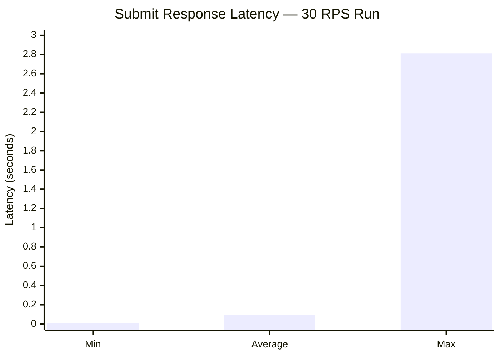

| Metric | Value |
|---|---|
| Minimum Latency | 8 ms |
| **Average Latency** | **97 ms** |
| Maximum Latency | 2,813 ms |

### Verdict Distribution

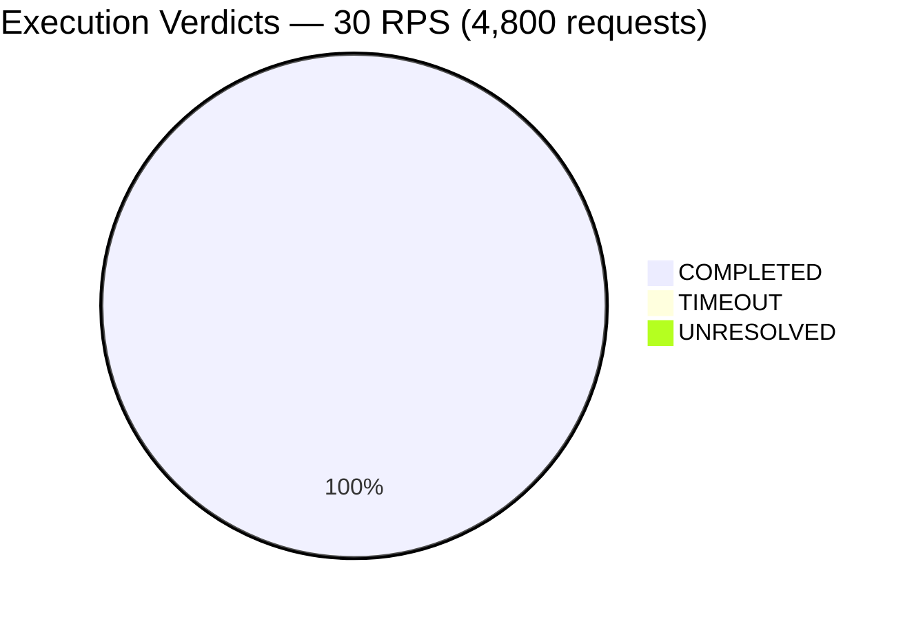

---

## 10. Load Test Results — 50 RPS

**Date:** May 22, 2026 | **Configuration:** 8 Sandbox Containers

### Throughput Summary

| Metric | Value |
|---|---|
| Total Requests | **9,950** |
| Waves Completed | 199 |
| Wall-Clock Time | 269.02 seconds |
| Overall Throughput | **37.0 req/s** |
| 202 Accepted | 9,950 (100%) |
| Completed Executions | 9,950 (100%) |
| WebSocket Push Failures | **0** |

### Latency Distribution

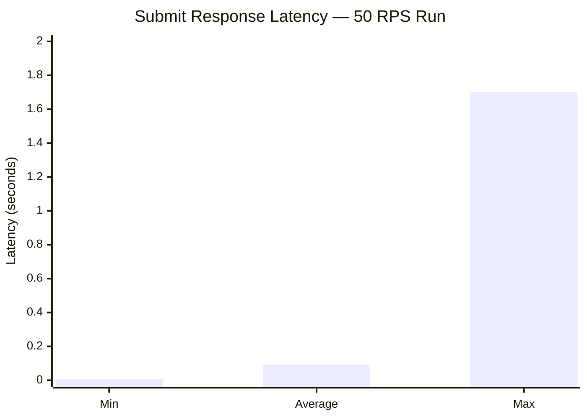

| Metric | Value |
|---|---|
| Minimum Latency | 7 ms |
| **Average Latency** | **92 ms** |
| Maximum Latency | **1,701 ms** (↓40% vs 30 RPS) |

### Grafana Dashboard Metrics

| Metric | Value | Assessment |
|---|---|---|
| Total Submissions Recorded | 9,950 | ✅ Matches submitted count |
| Total WS Results Sent | 9,951 | ✅ (+1 warm-up; Grafana counter was fresh at start of 50 RPS run — covers this run only) |
| WS Push Failures | **0** | ✅ Perfect delivery — no result dropped |
| Avg Submission Time (server-side) | **22.1 ms** | ✅ Extremely fast |
| Rate-Limited (429) | 0 | ✅ No throttling |
| Kafka Avg Processing Time | ~5ms (steady) → 50ms (spike) | ✅ Self-recovered |
| GC Pause Time Peak | **7ms** (G1 Minor GC) | ✅ Healthy |
| GC Pressure | Negligible / below threshold | ✅ No full GC |

---

## 11. Comparative Analysis

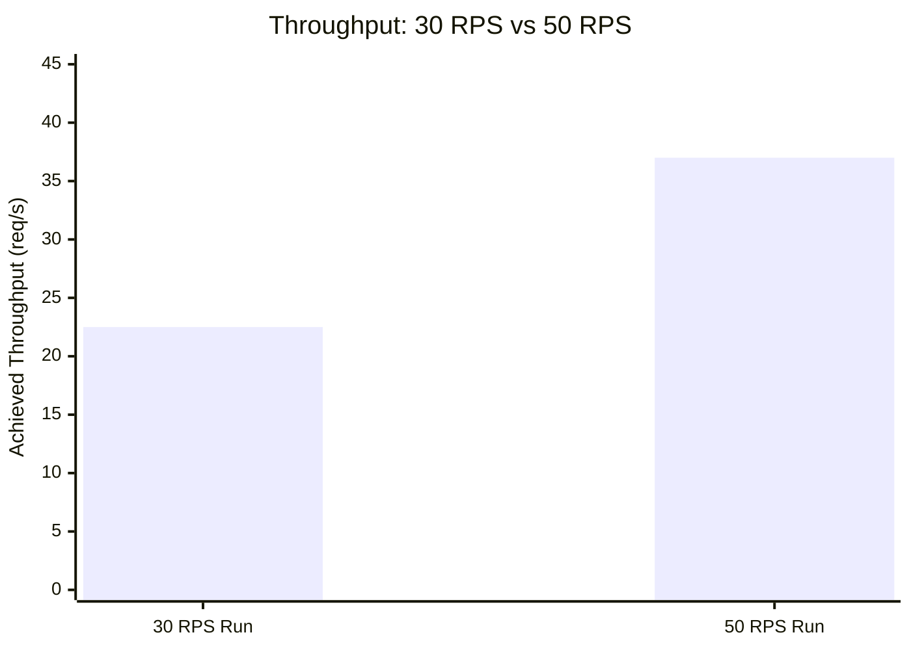

| Metric | 30 RPS Run | 50 RPS Run | Change |
|---|---|---|---|
| Total Requests | 4,800 | 9,950 | +107% |
| Achieved Throughput | 22.5 req/s | **37.0 req/s** | **+64%** ✅ |
| 202 Success Rate | 100% | 100% | = |
| Completion Rate | 100% | 100% | = |
| Avg Submit Latency | 97 ms | **92 ms** | **-5%** ✅ |
| Max Submit Latency | 2,813 ms | **1,701 ms** | **-40%** ✅ |
| WS Push Failures | 0 | 0 | = |

> **Note on WebSocket metrics:** The Grafana `WS Results Sent` counter (9,951) covers the **50 RPS run only** — the Prometheus counter was at its baseline value at the start of that run. The 30 RPS run also completed 4,800 executions with zero observed push failures; however, a separate cumulative WS counter for that run was not isolated in Grafana. Both runs independently confirmed 100% execution completion and zero failure indicators.
| GC Peak Pause | — | 7 ms | Healthy |

> **Key Finding:** The system scaled **linearly and cleanly** from 30 → 50 RPS with no degradation. Latency _improved_ under higher load — demonstrating that the architecture handles increased concurrency gracefully.

---

## 12. Observability — Prometheus & Grafana Metrics

The engine exposes a rich set of metrics via `/actuator/prometheus`. The Grafana dashboard (`execution-engine.json`) provides real-time visibility into:

```mermaid
graph LR
    Engine["Execution Engine\n(Spring Boot Actuator)"] -->|"/actuator/prometheus\n(scrape every 15s)"| Prom["Prometheus\n(Time-series DB)"]
    Prom -->|"PromQL queries"| Grafana["Grafana Dashboard"]
    Grafana --> Panels

    subgraph Panels["Dashboard Panels"]
        P1["📊 Total Submissions"]
        P2["📈 Submission Rate (req/s)"]
        P3["⏱️ Avg Submission Time (ms)"]
        P4["🔴 Rate-Limited (429) Count"]
        P5["📨 Kafka Processing Time"]
        P6["🌐 WS Results Sent / Failures"]
        P7["🗑️ GC Pause Time (ms)"]
        P8["💾 JVM Heap Usage"]
    end
```

### Key Metrics Definitions

| Metric | Description | 50 RPS Observed Value |
|---|---|---|
| `execution_submissions_total` | Counter — total code submissions received | 9,950 |
| `execution_submission_time_ms` | Histogram — server-side submission processing time | avg **22.1 ms** |
| `execution_rate_limited_total` | Counter — 429 responses issued | 0 |
| `execution_ws_results_sent_total` | Counter — WebSocket results delivered | 9,951 |
| `execution_ws_push_failures_total` | Counter — failed WebSocket deliveries | **0** |
| `kafka_consumer_fetch_latency_avg` | Kafka consumer fetch latency | ~5ms |
| `jvm_gc_pause_seconds` | G1 GC pause duration | **7ms peak** |
| `jvm_memory_used_bytes` | JVM heap usage | Stable (no leak) |

---

## 13. Capacity Planning

### Current Capacity (8 Containers)

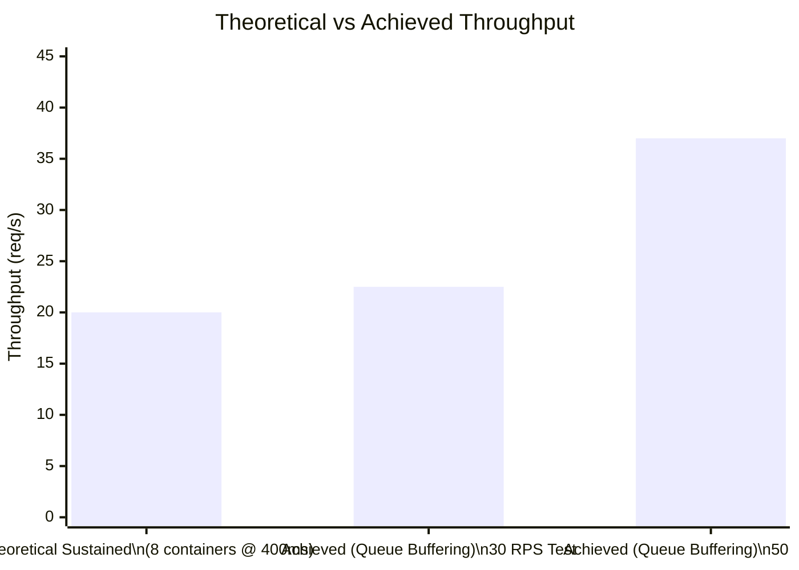

| Metric | Value |
|---|---|
| Theoretical sustained max | 8 ÷ 0.4s = **20 sub/s** |
| Achieved with Kafka queue buffering | **37 sub/s** (burst-wave pattern) |
| Headroom before queue saturation | ~500 queued tasks |
| Users to saturate (@ 5 RPM each) | **~444 concurrent users** |
| RAM for 8 sandbox containers | 8 × 256MB = **2 GB** |
| Kafka acquire timeout safety margin | 8s timeout vs 400ms execution = **20× margin** |

### Scaling Projections

| Container Count | Theoretical Max | Estimated Users (5 RPM) |
|---|---|---|
| 8 (current) | 20 sub/s | ~240 users |
| 12 | 30 sub/s | ~360 users |
| 20 | 50 sub/s | ~600 users |
| 40 | 100 sub/s | ~1,200 users |

> Increasing the container pool is a single configuration change (`APP_EXECUTION_POOL_WARM_MIN_SIZE`). No code changes required.

---

## 14. Error Handling & Resilience

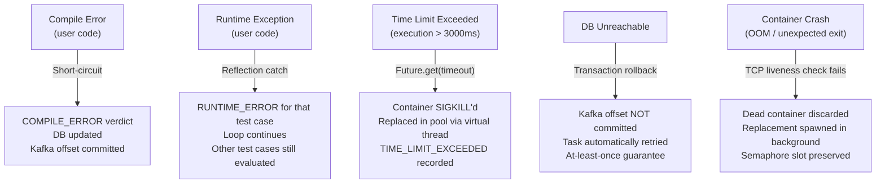

| Scenario | Detection Point | Recovery Behaviour |
|---|---|---|
| **Compile error** | Sandbox Wrapper | Short-circuit, return COMPILE_ERROR |
| **Runtime error** | Sandbox (reflection) | Mark test case, continue to next |
| **Timeout (TLE)** | Orchestrator Future | SIGKILL container, replace, record TLE |
| **DB failure** | Persistence layer | No Kafka commit → automatic retry |
| **Container crash** | TCP liveness probe | Discard + async replace via virtual thread |

---

## 15. Recommendations

| Priority | Recommendation | Business Impact |
|---|---|---|
| 🟡 Medium | Increase `APP_EXECUTION_POOL_WARM_MIN_SIZE` to **10–12** | Prevents queue spike when a container is replaced mid-load |
| 🟡 Medium | Set `spring.datasource.hikari.maximum-pool-size=20` | Prevents HikariCP bottleneck at 100 orchestration threads |
| 🟡 Medium | Enrich `/api/executions/{id}/status` to return `verdict`, `score`, `totalRuntimeMs` | Enables proper frontend polling + accurate load test reporting |
| 🟢 Low | Reduce `APP_KAFKA_CONCURRENCY` to 15, `APP_EXECUTION_ORCHESTRATION_THREADS` to 20 | Saves ~160MB JVM thread stack memory (over-provisioned vs 8 container slots) |
| 🟢 Low | Set `APP_REDIS_RATE_LIMIT_RPM` to a realistic value (e.g., 30) | Currently 10,000 = effectively disabled; enforce a sensible per-user limit |

---

*Document prepared for CodEval Platform stakeholder review — May 25, 2026*  
*All test data collected from local Docker environment running all services on a single host.*


